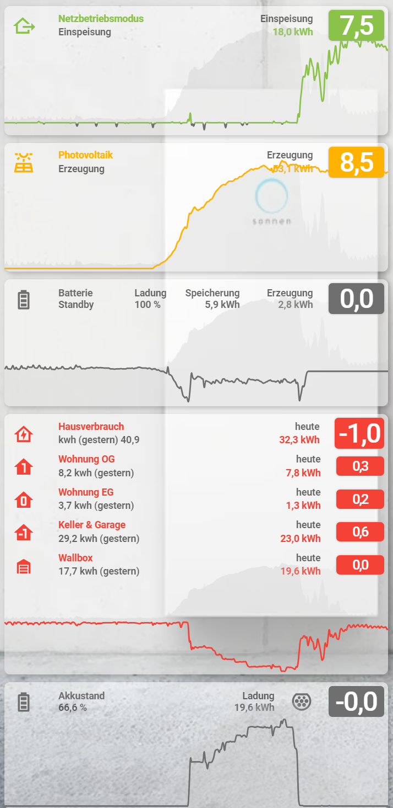

# HA-energy-cards
my way to clean graph cards without specific development based on default custom cards


## Where it started
While I was applying photovoltaik to my house and started also with a battery for the nights, I had home assistant already installed for many devices, but also smart gardening and irrigation.
Because i then started using an EV and applied a wallbox at home, the energy chapter in one place became a topic.
Unsatisfyingly home assistant did not give me the apperance I liked to have to combine solar panel production, battery management, wallbox, car. at least not out of the box.
Due to the need of some reconstruction in my power distribution, I had the opportunity to als apply some energy meters per floor.

Finally the idea for a new dashboard with default layout tiles was born to bring all these different digital inputs together.

A card having the visual representation of the meter, the days measurement, the last days one, the actual value, a specific dynamic state, icon and color.

# STEP 1 - Utility MARCOs
### getting the sensors ready
Before getting started visually, I tried to get the sensor templates ready to maintain all the values, but unfortunatly it went complicated immediate.
You can find them under [/custom_templates/energy_templates.jinja](./custom_templates/energy_templates.jinja):
#### macro map_w_to_kw(sensor, attribute, precision=int(1))
Is meant to apply a conversion from W to kW for a specific sensors state attribute, with a given precision you like, defaulted to 1.
but inside you will also find a reference to an manual input helper to reduce blur/noise to have a clean "0" (inactive) state from -/+ input value.
```
{{ ( ( raw / 1000) | round( precision | int( 1 ) ) ) }}{{ float(0) }}
```
#### macro map_w_to_state(sensor, attribute, positive, negative='', neutral='')
Is almost the same as above, but converts a state attribute of an entity into positive, negative and normalized neutral values/strings to map negative, positive and neutral to state labels.
#### macro map_w_state(sensor, positive, negative='', neutral='')
Is the same, but is made for an entity state and not for an entity's attribute state.
#### macro map_w_to_availability(sensor, attribute, precision=int(0))
Based on the before values just turns into on and off

# STEP 2 - template SENSORs
### building the template sensors
While we had prepared the helper templates, it becomes now time to create template sensors for our values we want to maintain in the coards.
All my different sensor follow the same style and just new names/referneces:

```
template:
  - sensor:
      - unique_id: "power_state_now"              <= to be able to manage them in UI, you shall give them unique ids
        unit_of_measurement: kW                   <= units simplify classifications
        device_class: power                       <= categories help either
        state_class: measurement                  <= and we have measurements here
```
So far nothing special, but now comes the tricky part.
We want to have friendly name to become dynamic, icon to change according to state, availability to change, and color being availacle.
Therefore remember the jinja templates from ontop. we always define the attribute with template, import the macro and make use of it:

For map_w_to_state or map_w_to_kw:
```
        name: >
            {{ map_w_to_state('sensor.sonnen_original_messwerte_statusapi','GridFeedIn_W','Einspeisung','Netzbezug','Selbstversorgung') }}
        icon: >
            {{ map_w_to_state('sensor.sonnen_original_messwerte_statusapi','GridFeedIn_W','mdi:home-export-outline','mdi:home-import-outline','mdi:home-lightning-bolt-outline') }}
        state: > 
            {{ map_w_to_kw('sensor.sonnen_original_messwerte_statusapi','GridFeedIn_W') }}
```
Or even other conversion ( ** note olor being one of the state attributes:** home assistant has default device category icn colors with available and unavailable colors, but we want to have positive/neutral/negative, so we maintain the state attribute we have to reference to in card_mod card)
```
        availability: >
            {{ iif(has_value('sensor.sonnen_original_messwerte_statusapi'),'on','off') }}
        attributes: 
            color: >
                {{ map_w_to_state('sensor.sonnen_original_messwerte_statusapi','GridFeedIn_W','#8BC34A','#FF5722','var(--state-unavailable-color)') }}
            watts: >
                {{ state_attr('sensor.sonnen_original_messwerte_statusapi','GridFeedIn_W') | int(0) }}
            label: "power_state_now"
```
For my battery I went even more crazy for the icon:
```
      - unique_id: "store_state_now"
        unit_of_measurement: kW
        device_class: power
        state_class: measurement
        name: >
            {{ map_w_to_state('sensor.sonnen_original_messwerte_statusapi','Pac_total_W','Erzeugung','Speicherung','Standby') }}
        state: > 
            {{ map_w_to_kw('sensor.sonnen_original_messwerte_statusapi','Pac_total_W') }}
        icon: >
            mdi:battery{{map_w_to_state('sensor.sonnen_original_messwerte_statusapi','Pac_total_W','','-charging','')}}-outline-low-medium-high
```

# STEP 3 - Entities CARDS
With some frequently used lovelace components.
A full copy of the grid related card you can find under [./grid-power-card-example](./grid-power-card-example)

### The finally I placed the first card into my locelace frontend using:
- custom:multiple-entity-row
- custom:mini-graph-card
- card_mod

top Line shall always have:
- Icon, Label, State, Color (dynamic sring from the sensor)
```
type: entities
entities:
  - type: custom:multiple-entity-row
    entity: sensor.power_state_now
    name: Netzbetriebsmodus
    unit: false
    secondary_info:
      attribute: friendly_name
```
friendly_name comes from the template sensor's **name**
```
    state_color: true
    color: var(--secondary-text-color)
```
the **--secondary-text-color** comes from the bottom of this in the card mod
```
    styles:
      color: '#FFFFFF !important'
      background-color: var(--icon-primary-color)
```
the **--icon-text-color** comes from the bottom of this in the card mod
```
      border-radius: 4px
      box-shadow: '0px 0px 2px #BBBBBB'
      height: auto
      padding: 8px 4px
      margin-right: 4px
      font-size: 28px
      font-weight: 500
      font-stretch: condensed
      letter-spacing: '-1px'
      min-width: 50px
      text-align: center
      line-height: 16px !important
      z-index: 1;
    entities:
      - entity: sensor.sonnen_power_consume_kwhd
```
  I also reference some utility meters for the daily consumption
```
        name: Netzbezug
        format: precision1
        styles:
          text-align: right
          width: 60px
          color: var(--consume-color) ;
```
the **--consume-color** comes from the bottom of this in the card mod
```
        hide_if:
          below: 0.5
      - entity: sensor.sonnen_power_produce_kwhd
```
  I also reference some utility meters for the daily production
```
        name: Einspeisung
        format: precision1
        styles:
          text-align: right
          width: 60px
          color: var(--produce-color);
```
the **--produce-color** comes from the bottom of this in the card mod
```
        hide_if:
          below: 0.5
  - type: custom:mini-graph-card
    align_header: left
    align_icon: left
    align_state: right
    entities:
```
**SCALING TRICK** 
instead of just putting our measurement subject into the graph #1, I add also the total consumption and the total production into the diagram #2 #3 , with infill and no line. By this all my cards will have the same scale on the dashboard.
That helps, even tough mini graph card supports min/max boundaries to be always dynamically scaled, but consistent across multiple grpahs.

```   - entity: sensor.power_state_now
        show_fill: false
      - entity: sensor.sonnen_produce_kw
        color: '#CCCCCC'
        show_line: false
      - entity: sensor.sonnen_consume_kw
        color: '#BBBBBB'
        show_line: false
    color_thresholds_transition: hard
    color_thresholds:
      - value: -0.15
        color: var(--consume-color)
```
the **--consume-color** comes from the bottom of this in the card mod
```
      - value: -0.149
        color: var(--state-unavailable-color)
      - value: 0
        color: var(--state-unavailable-color)
      - value: 0.149
        color: var(--state-unavailable-color)
      - value: 0.15
        color: var(--produce-color)
```
the **--produce-color** comes from the bottom of this in the card mod
the **--state-unavailable-color** unfortunatly we have to set for your desired range of values, because state colors or template colors are not supported (maybe with template_card achievable?)
```
    hour24: true
    group: true
    line_width: 2
    aggregate_func: median
    points_per_hour: 30
    hours_to_show: 12
    font-size: 120
    decimals: 1
    height: 150
    show:
      name: false
      icon: false
      state: false
      legend: false
    card_mod:
      style: |
        ha-card {
          background-color: rgba(255,255,255,0.0);
          border: 0px !important;
          border-radius: 0px !important;
          font-size: 12px !important;
          line-height: 12px;
          padding: 0px !important;
        }
card_mod:
  style: |
    ha-card {
      padding-top: -0px;
      background-color: rgba(255,255,255,0.5);
      border: 0px !important;
      border-radius: 6px !important;
      box-shadow: 2px 2px 5px rgba(0,0,0,0.2);
      font-weight: 600;
      font-size: 10px;
      font-stretch: condensed;
      letter-spacing: 0px;
      line-height: 14px;
```
HERE is now the ***coloring MAGIC**
```
      --icon-primary-color: {{ state_attr('sensor.power_state_now','color') }};
      --primary-text-color: {{ state_attr('sensor.power_state_now','color') }};
      --secondary-text-color: rgb(0,0,0,0.6);
      --consume-color: {{ iif(states('sensor.power_state_now')|float(0)<0,state_attr('sensor.power_state_now','color'),'var(--state-unavailable-color)') }};
      --produce-color: {{ iif(states('sensor.power_state_now')|float(0)>0,state_attr('sensor.power_state_now','color'),'var(--state-unavailable-color)') }};
    }
```
We are replacing the already available CSS variables for the default references:
- --icon-primary-color
- --primary-text-color
- --secondary-text-color
  
In addition for the graph we are creating our own variables for coloring:
- --produce-color
- --consume-color
```
    ha-card #states.card-content {
      padding: 0px;
    }
    ha-card #states > * {
      margin-bottom: 0px;
      margin-top: -40px;
    }
    ha-card .type-custom-multiple-entity-row {
      padding-right: 4px;
    }
```
